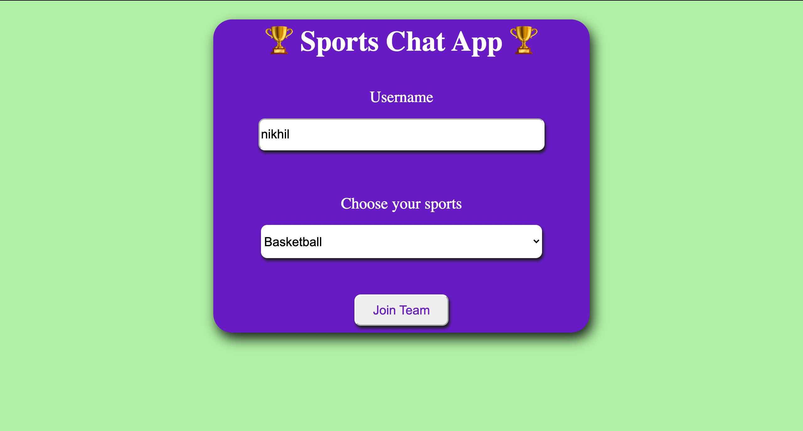
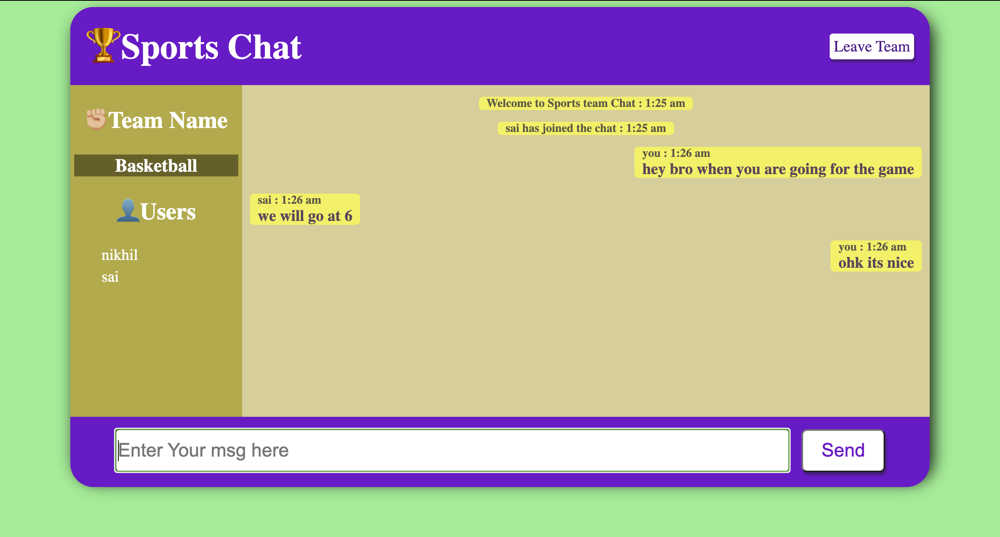

# Sports-Chat-App
A Chating app for multiple sports teams


<!-- PROJECT LOGO -->
<br />
<p align="center">
  <a href="https://shielded-atoll-74356.herokuapp.com/">
    
  </a>


  <h3 align="center">Sports Chat App</h3>

  <p align="center">
    A chating app for different sports teams
    <br />
    <a href="https://shielded-atoll-74356.herokuapp.com/"><strong>Explore the Project »</strong></a>
    <br />
    <br />
  </p>
</p>


<!-- ABOUT THE PROJECT -->
## About The Project

 
 <br/>
 I created this project for my implementation of web development knowledge to create a real-time chat application.<br/>
 In this application, we can chat with our friends by choosing the same team name by entering their name and choosing their team. 
 
 ## Features

-   Join a specified team room to chat
    
-   You can see who is online at that time on your left
    
-   Automatically scroll down upon receiving a new message
    
-   You can leave a meating and join other just by clicking leave button

-   The chat will be stored

 
 
<!--   The chat messages also show who and when somebody msg in the team room.
  If the messages overloaded in chat box than it will automatically scroll down to bottom and you can scroll up to see previous messages also.
  In left side of window you can see you team name and name of people online in team room at that time.
  There is also a leave button from where you can go on first page of Chat app and can join different team room. -->
  
  ## [](https://github.com/rubychi/udemy-chatapp#getting-started)Getting Started

Follow the instructions below to set up the environment and run this project on your local machine

### [](https://github.com/23MANIK/Sports-Chat-App/edit/master/#prerequisites)Prerequisites

-   Node.js

### [](https://github.com/23MANIK/Sports-Chat-App/edit/master/#installing)Installing

1.  Download ZIP or clone this repo

```
>gh repo clone 23MANIK/Sports-Chat-App
```

2.  Install dependencies via NPM

```
> npm install
```

5.  Back to the root directory and type the below command to start the server and the service

```
> node server.js
```

6.  See it up and running on  [http://localhost:3000](http://localhost:3000/)

  ## [](https://github.com/23MANIK/Sports-Chat-App/edit/master/#deployment)Deployment

1.  Deploy to Heroku

```
> heroku create
> git push heroku master
```

2.  Open the app in the browser

```
> heroku open
```

### Built With

### [](https://github.com/rubychi/udemy-chatapp#frontend)Frontend

-   [HTML]()
-   [CSS]()
-   [Javascript]()

### [](https://github.com/rubychi/udemy-chatapp#backend)Backend

* [node.js](https://nodejs.org/en/)
* [express](https://expressjs.com)

### [](https://github.com/rubychi/udemy-chatapp#backend)Database

* [MongoDb](https://www.mongodb.com)


### [](https://github.com/rubychi/udemy-chatapp#utils)Utils

* [socket.io](https://socket.io)
* [moment](https://momentjs.com)
* [mongoosejs](https://mongoosejs.com)

##  Notes

-   Send an event to everybody in the room 'The Office Fans'

```
io.emit -> io.to('The Office Fans').emit

```

-   Send an event to everybody in the room 'The Office Fans' except for the current user

```
socket.broadcast.emit -> socket.broadcast.to('The Office Fans').emit

```

-   Send an event to a specific user

```
socket.emit
```
<!--Author-->
## Authors

- [Nikhil Rajpoot](https://github.com/23MANIK)

<!-- CONTACT -->
## Contact

Nikhil Rajpoot - nikhil18@iitg.ac.in

Project Link: [https://shielded-atoll-74356.herokuapp.com/index.html](https://shielded-atoll-74356.herokuapp.com/index.html)


